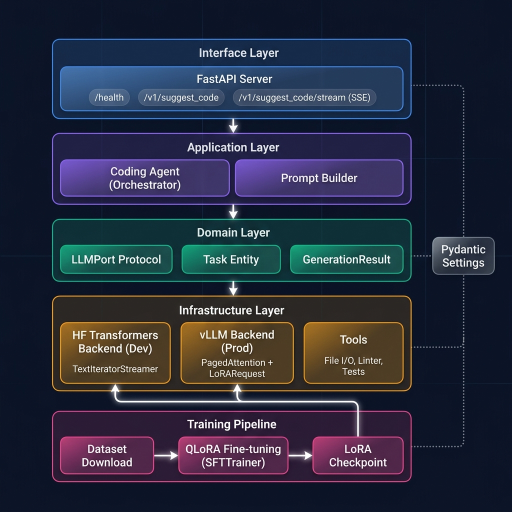

# Mini Coding Agent

A modular, config-driven coding agent powered by fine-tuned LLMs with LoRA/QLoRA.
Built on Sebastian Raschka's [6-component agent framework](https://magazine.sebastianraschka.com/p/components-of-a-coding-agent).

## Features

- **Dual inference backends** — HuggingFace Transformers or vLLM (high-throughput)
- **QLoRA fine-tuning** — 4-bit quantized training on consumer GPUs
- **Streaming generation** — real-time SSE endpoint for token-by-token output
- **Clean architecture** — domain ports, dependency injection, structured config
- **Interactive agent loop** — multi-turn tool use with session memory
- **Live repo context** — git-aware workspace scanning (branch, status, docs)
- **Context reduction** — clipping, transcript compression, read deduplication
- **Bounded subagents** — read-only child agents for side investigations
- **Session persistence** — JSON-backed transcript + working memory
- **Production hardened** — health checks, CORS, path sandboxing, approval gates

## Architecture



### The 6 Agent Components

```
Component 1: Live Repo Context       → infrastructure/workspace.py
Component 2: Prompt Shape & Cache    → application/prompt_builder.py
Component 3: Tools & Permissions     → infrastructure/tools.py + agent._run_tool()
Component 4: Context Reduction       → application/context_manager.py
Component 5: Session Memory          → domain/session.py + infrastructure/session_store.py
Component 6: Bounded Subagents       → application/agent.py (_tool_delegate)
```

### Directory Layout

```
config/           # Centralized Pydantic-validated settings + YAML config
domain/           # Entities (Task, Session, GenerationResult) + ports (LLMPort)
infrastructure/   # LLM backends, tools, workspace context, session store
application/      # Agent orchestration, prompt builder, context manager
interface/        # FastAPI HTTP layer
scripts/          # Training, data download, standalone inference
tests/            # Unit tests (46 tests)
```

## Quick Start

### 1. Install

```bash
# Core dependencies
pip install -e .

# With dev tools (pytest, ruff, mypy)
pip install -e ".[dev]"

# With vLLM backend (optional, requires GPU)
pip install -e ".[vllm]"
```

### 2. Configure

```bash
cp .env.example .env
# Edit .env with your HuggingFace token, model name, etc.
# Or edit config/config.yaml directly
```

### 3. Train (on a GPU machine)

```bash
# Download and preprocess the dataset
python scripts/download_dataset.py

# Fine-tune with QLoRA
python scripts/train_lora.py
```

### 4. Test inference

```bash
# Interactive REPL (quickest way to verify the model works)
python -m scripts.infer --interactive

# Single prompt
python -m scripts.infer "Write a Python function to reverse a linked list"
```

### 5. Serve the API

```bash
# Production
python main.py

# Development (with hot reload)
make serve-dev
```

### 6. Call the API

```bash
# Health check
curl http://localhost:8000/health

# Generate code (full response with lint + tests)
curl -X POST http://localhost:8000/v1/suggest_code \
  -H "Content-Type: application/json" \
  -d '{"description": "Write a function to merge two sorted lists"}'

# Streaming response
curl -X POST http://localhost:8000/v1/suggest_code/stream \
  -H "Content-Type: application/json" \
  -d '{"description": "Write a binary search function"}'

# Interactive agent loop (with tools + memory)
curl -X POST http://localhost:8000/v1/agent/ask \
  -H "Content-Type: application/json" \
  -d '{"message": "Read the tests in tests/ and fix any failures"}'

# Check working memory
curl http://localhost:8000/v1/agent/memory

# List saved sessions
curl http://localhost:8000/v1/agent/sessions
```

## Configuration

Settings are loaded in this priority order: **env vars > config.yaml > defaults**

| Env Variable           | Config Key              | Default           |
| ---------------------- | ----------------------- | ----------------- |
| `AGENT_MODEL_NAME`     | `model.name`            | `Qwen/Qwen2-7B`  |
| `AGENT_DEVICE`         | `model.device`          | `cuda`            |
| `AGENT_BACKEND`        | `model.backend`         | `transformers`    |
| `AGENT_MAX_NEW_TOKENS` | `model.max_new_tokens`  | `512`             |
| `AGENT_MAX_STEPS`      | `agent.max_steps`       | `6`               |
| `AGENT_MAX_DEPTH`      | `session.max_depth`     | `1`               |
| `HF_TOKEN`             | —                       | —                 |

## Docker

```bash
docker build -t coding-agent .
docker run --gpus all -p 8000:8000 coding-agent
```

## Development

```bash
make dev           # Install dev dependencies
make lint          # Run ruff linter
make format        # Auto-format code
make test          # Run unit tests (46 tests)
make typecheck     # Run mypy
```

## API Endpoints

| Method | Path                       | Description                              |
| ------ | -------------------------- | ---------------------------------------- |
| GET    | `/health`                  | Liveness / readiness probe               |
| POST   | `/v1/suggest_code`         | Full generation + lint/test output       |
| POST   | `/v1/suggest_code/stream`  | Streaming SSE token output               |
| POST   | `/v1/agent/ask`            | Interactive agent loop (tools + memory)  |
| GET    | `/v1/agent/memory`         | Current working memory                   |
| GET    | `/v1/agent/session/{id}`   | Retrieve a saved session transcript      |
| GET    | `/v1/agent/sessions`       | List all saved session IDs               |

## License

MIT